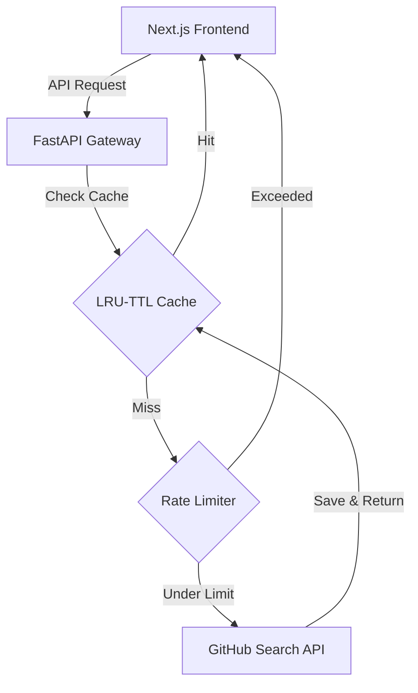

# Let's Build — Developer Projects Finder

A high-performance discovery sandbox and repository explorer built to help developers seamlessly bridge the gap between inspiration and implementation. 

This project consists of:
*   **FastAPI Backend Gateway**: Handles query optimization, rate limiting, and in-memory TTL caching.
*   **Next.js Frontend**: A dark, glassmorphic client interface with an interactive particle background and dynamic filter controls.

---

## 💡 Why This Project Matters for Idea Exploration

When starting a new software project or exploring a product concept, the hardest step is going from a blank screen to a working architecture. Traditional search engines and standard GitHub searches often return noisy, irrelevant results. 

**Let's Build** solves this by acting as a highly structured exploration engine:

### 1. Overcoming the "Blank Page" Syndrome
Looking for inspiration on how to pair **FastAPI** with **React**, or **PyTorch** with **LangChain**? Instead of searching tutorials, you can query both tags simultaneously. It lets you instantly discover real-world repository layouts, folder structures, and configuration setups that are already working.

### 2. Production-Grade Benchmarking
By using the **Min Stars** filter (e.g., `1K+`, `5K+`, `10K+`), you filter out half-finished scrap code and isolate production-grade, highly-regarded repositories. This allows you to benchmark:
*   How top-tier projects structure their tests.
*   How they manage dependency injection or database sessions.
*   Which packages they use in their production lockfiles.

### 3. Deep Feature Discovery (README & Code Crawling)
Most developers don't manually tag their repositories with GitHub topics. **Let's Build** bypasses this metadata bottleneck by automatically expanding your filter queries into compound search clauses. It searches for keywords directly inside repository **titles, descriptions, and entire README files** (e.g., `topic:fastapi OR "fastapi" in:name,description,readme`), guaranteeing that you find hidden gems and codebases that would otherwise remain invisible.

### 4. Avoiding Redundant Engineering
Before you spend weeks writing a custom utility library, microservice template, or auth wrapper, you can search for similar concepts. Inspecting existing implementations helps you decide whether to fork an existing project, contribute to it, or borrow its design patterns to write a better version.

---

## 🛠️ Architecture & Features



### Key Technical Implementations
*   **Smarter Query Compilation**: Translates selected categories, topics, and languages into clean parenthesized boolean logic (`AND` / `OR`) compatible with GitHub's Search API syntax.
*   **LRU-TTL Cache**: Caches frequent query outputs in-memory to conserve GitHub's API rate limits.
*   **Rate Limiter**: Employs a sliding-window algorithm per client IP to safeguard against spam.
*   **Interactive Particle UI**: An interactive 3D particle sphere in the background that reacts dynamically to cursor movements (built using Framer Motion).

---

## 🚀 Setup & Installation

### Prerequisites
*   **Python**: Version 3.11+
*   **Node.js**: Version 20+
*   **npm**: Version 10+

### 1. Backend Setup (FastAPI)
1. Navigate to the repository root.
2. Create and activate a virtual environment:
   ```bash
   python -m venv .venv
   # On Windows:
   .venv\Scripts\activate
   # On macOS/Linux:
   source .venv/bin/activate
   ```
3. Install dependencies:
   ```bash
   pip install -r requirements.txt
   ```
4. Create a `.env` file in the root directory and add your GitHub Personal Access Token (PAT) to bypass the unauthenticated rate limits (60/hr -> 5,000/hr):
   ```env
   GITHUB_PAT="your_github_personal_access_token_here"
   ```
5. Start the API gateway:
   ```bash
   uvicorn main:app --reload --host 127.0.0.1 --port 8000
   ```
   *Health check endpoint: [http://127.0.0.1:8000/api/health](http://127.0.0.1:8000/api/health)*

---

### 2. Frontend Setup (Next.js)
1. Navigate into the frontend folder:
   ```bash
   cd repo-explorer-frontend
   ```
2. Install dependencies:
   ```bash
   npm install
   ```
3. Ensure you have a `.env.local` containing the API url:
   ```env
   NEXT_PUBLIC_API_BASE=http://127.0.0.1:8000
   ```
4. Run the development server:
   ```bash
   npm run dev
   ```
5. Open your browser and explore: [http://localhost:3000](http://localhost:3000)
